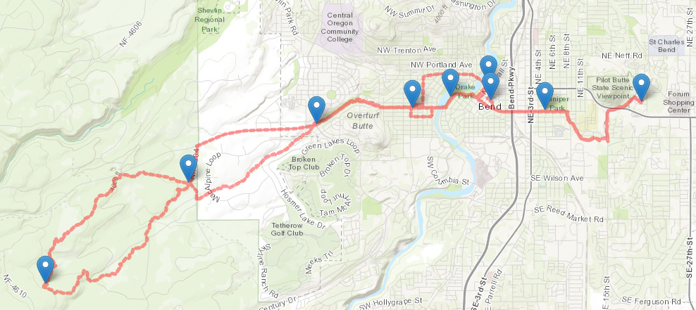

# Last Kook Cruise Bike Route
By Killian Cochran

**One of the best days on my bike** 

Each year starting in the spring and ending in the fall, a group of friends gather every wednesday evening at Thump Coffee in downtown Bend, Oregon to free ride the city on bikes. This group of friends coined this weekly event the Kook Cruise. The route shown in the map above was the last route of the 2023 season. It was also the last route I did with the group before moving back to North Carolina. 

The major functions of this map are the locations marked. Hovering the mouse over each point reveals the name of the location. Each point was a major stop along the route, including the coffee shop where we all meet each week, a park, and the taco shop we went to for dinner. Another function found in the map description is a direct link to my strava account to see the stats for the route. 

The data source for this map project is Strava. I logged into my account and downloaded the GPX file which plotted the entire route in GeoJSON. The file was then saved and converted to a JavaScript file, found in the data folder. For the code format, I referred to the current lab worksheet, as well as previous labs for different functions and styling.

Stats for the Kooks on [Strava](https://www.strava.com/activities/9845356522)
